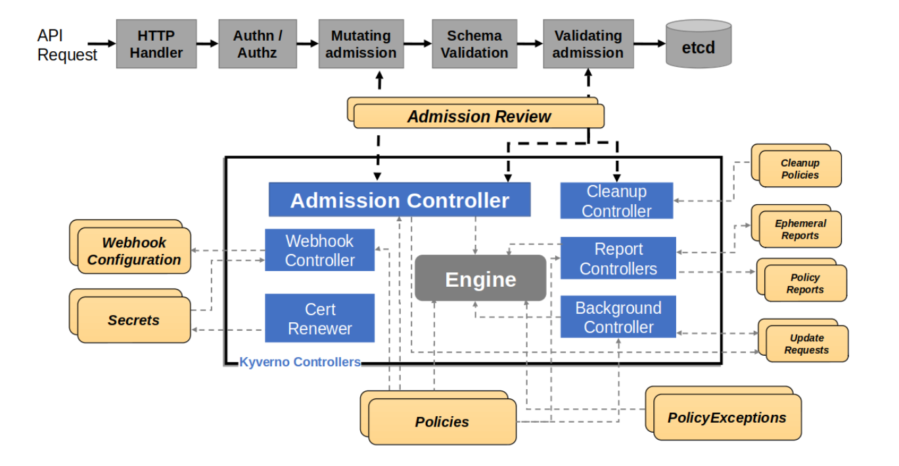

## Rohit's Adventure with Kyverno

#### Overview

Recently, at one of my client sites, I was tasked with enhancing the OpenShift cluster for compliance and security. OpenShift provides a variety of built-in security and compliance features, including role-based access control for distinguishing between cluster-admins and developers, as well as admission controllers that enforce resource syntax, adhere to Custom Resource Definition (CRD) rules, and restrict privileged workloads on the platform. However, there are advanced use cases that OpenShift's built-in capabilities do not address. This is where Kyverno becomes invaluable—it allows creation of cluster guardrails so developer teams remain within the boundaries of best practices and expected standards.

#### Architecture

Kyverno consists of several controllers that operate between the API server and the etcd database. It can enforce rules to prevent resources with certain labels from being admitted or require resources to carry specific annotations using its admission controller. Kyverno includes the Background Controller, Cleanup Controller, and Reports Controller. The Background Controller is especially useful for mutating and deleting existing resources, while the Reports Controller generates findings and rule violation reports.

<br>


<br>

### Kyverno Controller Roles

| Controller | Primary Function | Applies To |
| :-- | :-- | :-- |
| Admission Controller | Resource admission | New resource requests |
| Background Controller | Mutations \& deletions | Existing resources |
| Reports Controller | Policy violations | Reporting \& compliance |

#### Use Cases

Before diving into specific rules, it’s important to understand the concept of Policies and ClusterPolicies in Kyverno. A ClusterPolicy applies rules across all namespaces, whereas a Policy resource restricts rules to select namespaces. Policies can either audit all rule violations (observing but not blocking) or block resources that violate specific rules.

Some of the policies I created to enforce guardrails and best practices:

1. **Audit if deployments use secrets as environment variables**
```
apiVersion: kyverno.io/v1
kind: ClusterPolicy
metadata:
  name: secrets-not-from-env-vars
  annotations:
    policies.kyverno.io/title: Disallow Secrets from Env Vars
    policies.kyverno.io/category: Sample, EKS Best Practices
    policies.kyverno.io/severity: medium
    policies.kyverno.io/subject: Pod, Secret
    kyverno.io/kyverno-version: 1.6.0
    policies.kyverno.io/description: >-
      Secrets used as environment variables containing sensitive information may, if not carefully controlled, 
      be printed in log output which could be visible to unauthorized individuals and captured by forwarding
      applications. This policy disallows using Secrets as environment variables.
spec:
  validationFailureAction: Audit
  background: true
  rules:
  - name: secrets-not-from-env-vars
    match:
      any:
      - resources:
          kinds:
          - Pod
    validate:
      message: "Secrets must be mounted as volumes, not as environment variables."
      pattern:
        spec:
          containers:
          - name: "*"
            =(env):
            - =(valueFrom):
                X(secretKeyRef): "null"
  - name: secrets-not-from-envfrom
    match:
      any:
      - resources:
          kinds:
          - Pod
    validate:
      message: "Secrets must not come from envFrom statements."
      pattern:
        spec:
          containers:
          - name: "*"
            =(envFrom):
            - X(secretRef): "null"
```

This cluster policy operates across all pods and ensures they do not reference `secretKeyRef` in their spec. The syntax `=()` in the policy checks for the presence of the `env` key before inspecting `valueFrom`, which prevents errors if previous fields are missing. Policies often contain multiple rules of similar intent, as in this case where two rules check for secret keys within pods.

2. **Signature validation for container images**
```
apiVersion: kyverno.io/v1
kind: ClusterPolicy
metadata:
  name: verify-image
  annotations:
    policies.kyverno.io/title: Verify Image
    policies.kyverno.io/category: Sample, EKS Best Practices
    policies.kyverno.io/severity: medium
    policies.kyverno.io/subject: Pod
    policies.kyverno.io/minversion: 1.7.0
    policies.kyverno.io/description: >-
      Using the Cosign project, OCI images may be signed to ensure supply chain
      security is maintained. Signatures can be verified before pulling into
      a cluster. This policy checks the signature of an image repo called
      ghcr.io/kyverno/test-verify-image to ensure it has been signed, verifying
      against the provided public key. This example must be modified for your own images
      and keys.
spec:
  validationFailureAction: enforce
  background: false
  rules:
    - name: verify-image
      match:
        any:
        - resources:
            kinds:
              - Pod
      verifyImages:
      - imageReferences:
        - "ghcr.io/kyverno/test-verify-image:*"
        mutateDigest: true
        attestors:
        - entries:
          - keys:
              publicKeys: |
                -----BEGIN PUBLIC KEY-----
                MFkwEwYHKoZIzj0CAQYIKoZIzj0DAQcDQgAE8nXRh950IZbRj8Ra/N9sbqOPZrfM
                5/KAQN0/KjHcorm/J5yctVd7iEcnessRQjU917hmKO6JWVGHpDguIyakZA==
                -----END PUBLIC KEY-----
```

Kyverno also supports image signature verification to ensure supply chain security. This policy matches all pods using images from `ghcr.io/kyverno/test-verify-image:*` and verifies their signatures against a provided public key. You can change image references to match all images from registries such as `ghcr.io` or `quay.io` using wildcard syntax:

```yaml
- imageReferences:
  - "ghcr.io/*"
  - "quay.io/*"
```

Predicate, annotation checks, and attestation policies can provide additional granularity. Along with key-pair-based verification, cosign supports keyless and certificate-based validations.

PS: These policies are from the official Kyverno documentation. Check it out for more use cases: [Kyverno Policies](https://release-1-8-0.kyverno.io/policies/other/verify_image/)

#### Good to Know

- Kyverno can be configured to ignore certain namespaces using a ConfigMap called `kyverno`. You can specify namespaces to ignore by labels and wildcards, using `resourceFilter` and `webhook` keys.

```yaml
resourceFilters: '[*/*,test,*], [*/*, openshift-*,*]'
webhook: webhooks: '[{\"namespaceSelector\":{\"matchExpressions\":[{\"key\":\"kubernetes.io/metadata.name\",\"operator\":\"NotIn\",\"values\":[\"kube-system\"]},{\"key\":\"kubernetes.io/metadata.name\",\"operator\":\"NotIn\",\"values\":[\"kyverno\"]}],\"matchLabels\":null}}]'
```

The resource filter prevents ClusterPolicy and Policy application in `test` or any namespace prefixed with `openshift-`, such as `openshift-apiserver` or `openshift-etcd`. Webhooks use namespace selectors and labels to exclude specific namespaces from processing.

> Webhooks instruct the API server about what NOT to send to Kyverno, whereas the resource filter in the ConfigMap tells Kyverno what NOT to process (i.e., ignore).

> Background requests are not affected by resourceFilters and webhooks, since they apply only to admission reviews. To mutate existing resources, use match/exclude keys within policy definitions.
